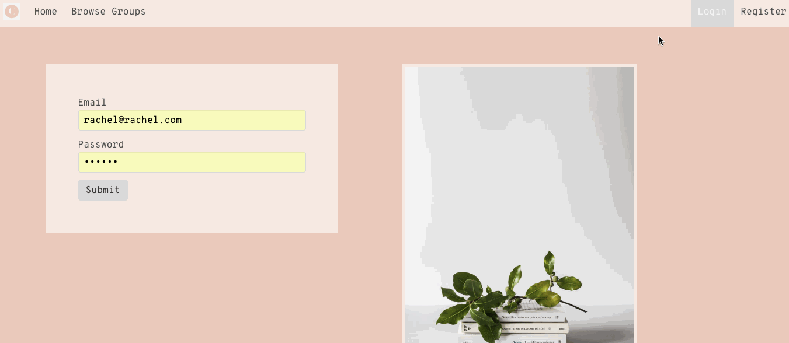
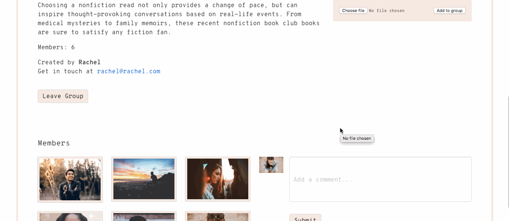

# GA WDI-34  Project #4: A MERN stack Application
## Chapter

Chapter is a MERN stack application that allows a user to create and/or discover online book groups and participate in discussion around their favourite books.

For my final project I wanted to build something that reflected my own interests, practiced what I’d learnt on the course and also use a new technology which I was really excited about.

 ### The Build

The application was built using React and Express, and used a RESTful design pattern.

The app allows users to create and join book groups online to be part of a discussion. I used Google’s Vision API which allowed the creator of a book group to take a photo of a book, post it in the group, and the API then reads the image and sends back urls to the most relevant websites which feature the same image, in this case predominantly websites to purchase or read reviews of a book.

 ### Learnings

This time around I did plenty of research and reading of Google's documentation for its API before I started coding. This way I knew exactly what kind of request I needed to make, and what data came back so I could plan more thoroughly instead of rushing straight in.

However, as it was my final project I wanted to  show off what I'd learnt on the course so didn't fully take into account the fact that I was building the front end in a framework that I hadn't spent long learning. So I planned for more features than I was able to implement following MVP.

 ### Extra Features

Moving forward I’d like to implement the following features.

* Make the books themselves more prominent, i.e., allow a group to display previous books, and allow comments to be attached to specific books rather than only the group.  
* The group creator can choose whether a group is public or private.
* Include moderation - if a group is private the group creator must approve users who wish to join.
